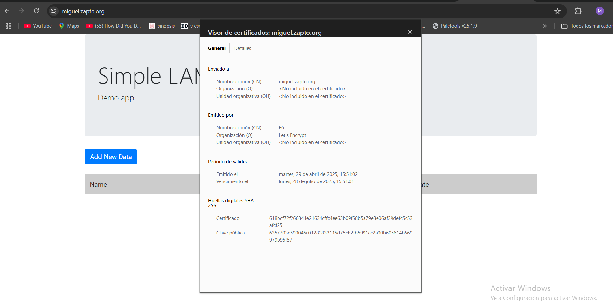

# practica-1.5
repo de la practica 1.5
Para esta práctica vamos a realizar la configuración de un certificado lets Encrypt y usando Cerbot en apache.
Para ello, usaremos nuestros scripts previamente realizado en prácticas anteriores como son : install lamp, intall-tool ,deploy....
Por supesto,no olvidar que usaremos nuestra variables de entorno.

El primer paso que vamos a realizar, será registrar un nombre de dominio en la página NO-IP

Lo segundo será tirar el script de la pila lamp.

## Instalar y configurar el cliente ACME Certbot

```bash
set -ex
```
Importamos el archivo de variables

```bash
source .env
```

Instalamos y actualizamos snap

```bash
snap install core
snap refresh core
```

Eliminamos instalaciones previas de cerbot con apt

```bash
apt remove certbot -y
```

Instalamos Certbot

```bash
snap install --classic certbot
```

Solicitamos un cerficado a Let`s Encrypt

```bash
sudo certbot --apache -m $LE_EMAIL --agree-tos --no-eff-email -d $LE_DOMAIN --non-interactive
```

## comprobaciones.


